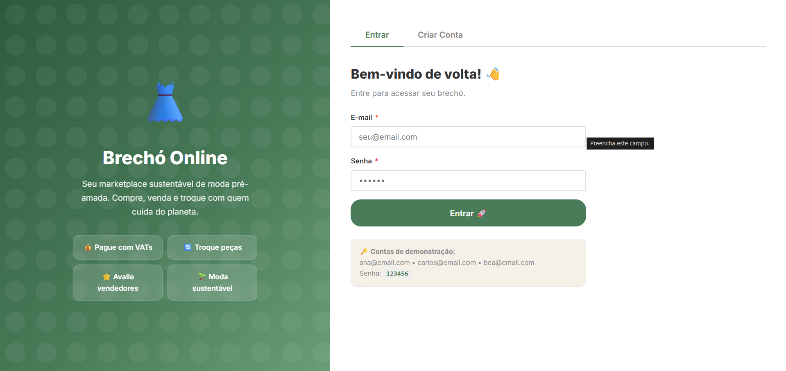
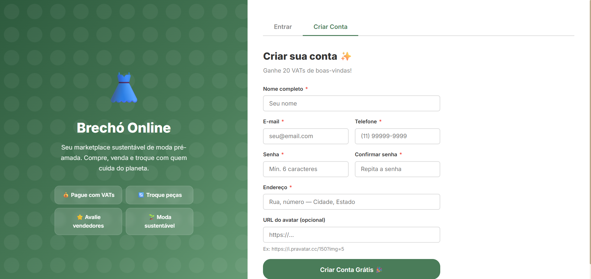
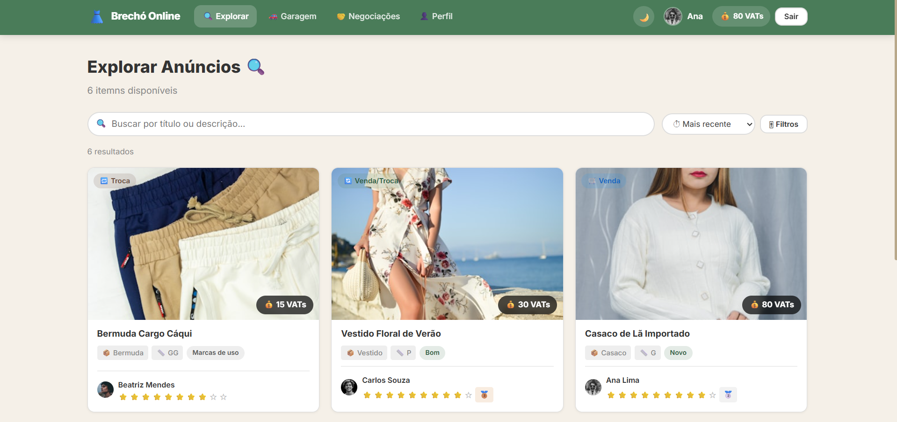
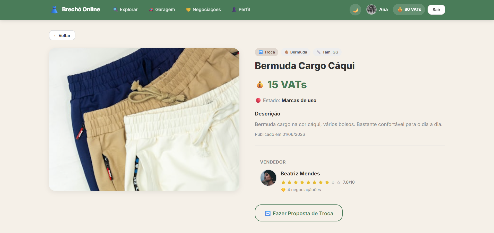
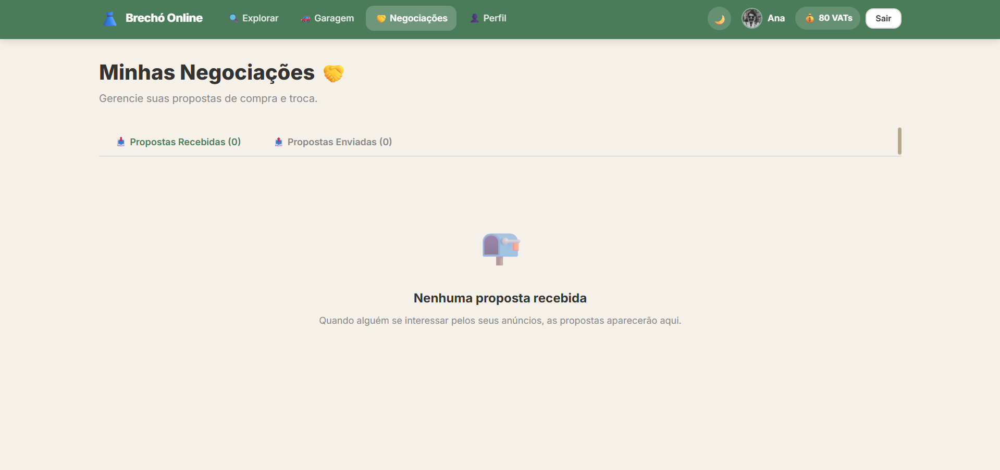
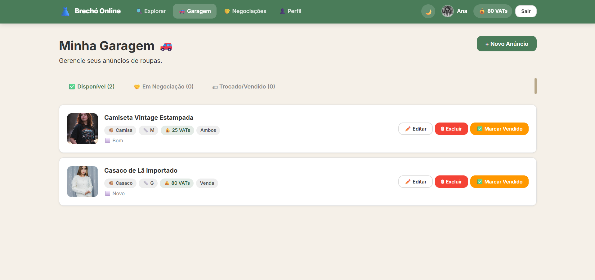

# Brechó Online

## Integrantes

* André Igor Vasconcelos da Silva
* Francisco Rodrigo da Silva Matos
* João Victor Brito Ribeiro
* Taislene da Silva Gonçalves

**Curso:** Sistemas de Informação
**Disciplina:** Projetos de Sistemas Web I
**Instituição:** IFCE - Campus Crato

---

## Descrição do Sistema

O Brechó Online é uma aplicação front-end desenvolvida em React que permite a compra, venda e troca de peças de roupa entre usuários.

A plataforma oferece recursos de cadastro e gerenciamento de anúncios, negociação por meio de propostas e contrapropostas, chat temporário entre participantes, sistema de avaliações e utilização da moeda virtual VAT (Valor para Troca), utilizada para facilitar negociações e equivalência de valores entre itens.

Os dados da aplicação são persistidos utilizando localStorage, simulando o funcionamento de um sistema real sem necessidade de back-end.

---

## Tecnologias Utilizadas

* React
* Vite
* JavaScript (ES6+)
* CSS3
* LocalStorage
* Git e GitHub

---

## Instalação e Execução

### Pré-requisitos

* Node.js 18 ou superior
* npm

### Passos para execução

```bash
# Clonar o repositório
git clone https://github.com/RodrigoMatos00/brecho-online.git

# Entrar na pasta do projeto
cd brecho-online

# Instalar dependências
npm install

# Executar em modo de desenvolvimento
npm run dev
```

A aplicação estará disponível em:

```text
http://localhost:5173
```

### Contas de Demonstração

Senha para todas as contas:

```text
123456
```

Usuários:

* [ana@email.com](mailto:ana@email.com)
* [carlos@email.com](mailto:carlos@email.com)
* [bea@email.com](mailto:bea@email.com)

---

## Telas Principais

### Login



### Cadastro



### Explorar Anúncios



### Detalhes do Anúncio



### Negociações



### Perfil do Usuário


### Garagem Virtual



---

## Funcionalidades Implementadas

### Funcionalidades Obrigatórias

* [x] Autenticação simulada
* [x] Persistência de usuário logado
* [x] Cadastro de anúncios
* [x] Edição e gerenciamento de anúncios
* [x] Filtros e busca
* [x] Sistema de moeda virtual VAT
* [x] Sistema de propostas de compra
* [x] Sistema de propostas de troca
* [x] Contrapropostas
* [x] Histórico de negociações
* [x] Chat temporário
* [x] Garagem Virtual
* [x] Avaliações pós-negociação
* [x] Perfil com estatísticas
* [x] Interface responsiva

### Funcionalidades Opcionais

* [x] Modo escuro persistente
* [x] Animações suaves
* [x] Selos de confiabilidade
* [x] Gráfico de evolução dos VATs
* [ ] Carrinho de troca múltipla

---

## Estrutura do Projeto

```text
src/
├── components/
├── context/
├── pages/
├── utils/
├── assets/
└── App.jsx
```

---

## Dificuldades Encontradas e Soluções

| Dificuldade                               | Solução                                                        |
| ----------------------------------------- | -------------------------------------------------------------- |
| Persistência dos dados da aplicação       | Utilização de funções auxiliares centralizadas em localStorage |
| Sincronização do estado global do usuário | Implementação de Context API                                   |
| Controle de negociações e contrapropostas | Modelagem de estrutura baseada em histórico de eventos         |
| Simulação de chat sem back-end            | Armazenamento e atualização local via localStorage             |
| Persistência do tema escuro               | Utilização de atributo data-theme e armazenamento local        |
| Organização do projeto                    | Separação por componentes, páginas, contexto e utilitários     |

---

## Considerações Finais

O projeto permitiu aplicar conceitos fundamentais de desenvolvimento front-end utilizando React, gerenciamento de estado, componentização, persistência local de dados e versionamento com Git e GitHub.

Além das funcionalidades obrigatórias propostas, foram implementados recursos adicionais que melhoram a experiência do usuário, como modo escuro, sistema de selos e gráficos de evolução dos VATs.